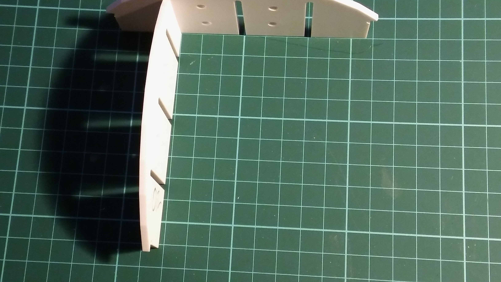

# R2D2

This repository is to organize my hardware and software files for my styrene R2D2 project. Currently most of the files are still in very early stages of development and yet unpublished.
## Background:
The structural hardware is based on the eggcrate styrene frame by [Frank Pirz](http://www.r2d2.media-conversions.net/). Frank did an amazing job in developing a design for a frame that is easy to assemble by having the parts slide into each other with appropriate slots. These slots were however designed for imperial measurements.

Trying those on 3mm styrene sheets instead of 1/8th of an inch showed to be a bit loose:

What you see is two pieces of 3mm styrene with 1/8th inch slots. There is visible deflection and the connection was very loose. After seeing this, I decided to modify all of Frank's files to have 3mm slots to give a tighter connection to ease assembly and gluing.

## Current status:
to be updated over time.

## Plans for the future:

* finalize metric version of Frank's plans
* add 232 functionality
* hardware and software designs for PSIs and logic displays
* actuation of all panels
* ...
---

Please visit www.astromech.net!

#### Disclaimer:
R2D2 is copyrighted by LucasFilms Ltd.

A lot of the material in this repository is copyrighted by Media-Conversions LLC and published in a modified version with permission by Media-Conversions
